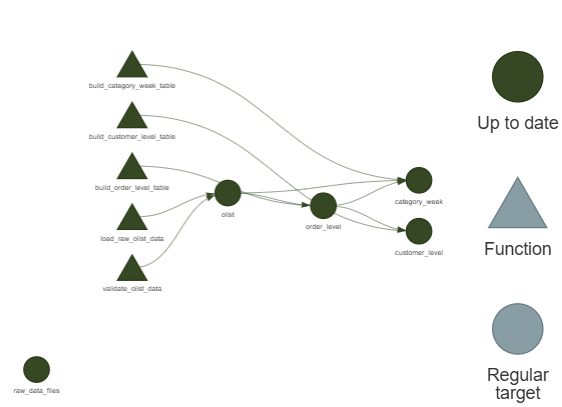

# retailDemandIntelligence
Hierarchical forecasting, CLV, and churn analytics for retail — built in R

Dependency graph generated via tar_visnetwork() — shows the full data pipeline from raw ingestion to analytical tables, with automatic caching and invalidation.